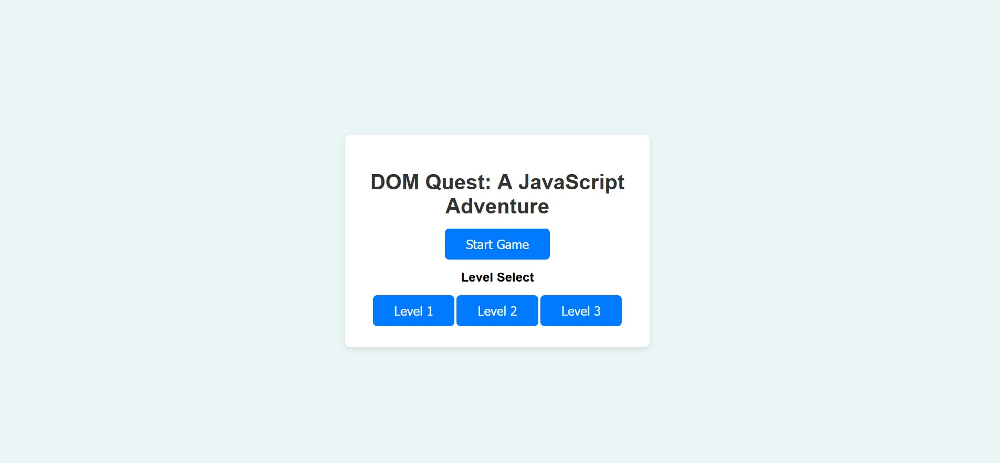
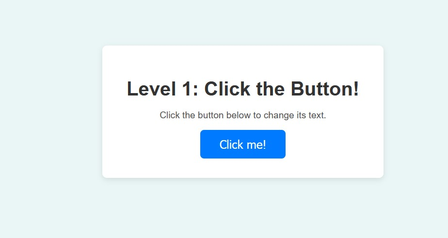
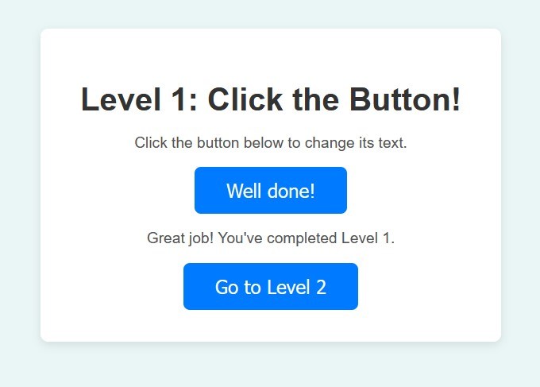

# DOM Quest: A JavaScript Adventure

## Descripción
**DOM Quest** es un juego interactivo diseñado para enseñar las bases de la programación en JavaScript, con un enfoque específico en la manipulación del DOM. Este juego está estructurado por niveles, comenzando con conceptos básicos y progresando hacia temas más avanzados, mientras los jugadores resuelven desafíos de programación que les permiten aprender mientras se divierten.

- **Lenguaje:** JavaScript
- **Enfoque:** Manipulación del DOM
- **Niveles:** Principiante e intermedio, con planes de agregar más niveles en futuras actualizaciones.

## Funcionalidades
- 🔥 Aprende a manipular elementos del DOM con `getElementById`, `querySelector`, y más.
- 🎮 Desafíos interactivos que te guían a través de diferentes niveles de dificultad.
- 🌱 Ideal para principiantes y personas con conocimientos intermedios que deseen mejorar sus habilidades en JavaScript.
- 📈 Estructura progresiva: Cada nivel se basa en lo que aprendiste en el anterior.

## Capturas de Pantalla

### Pantalla Principal


### Primer Nivel


## Cómo Jugar

1. **Clona el repositorio**:
   ```bash
   git clone https://github.com/tu-usuario/DOM-Quest.git
   ```
2. **Abre el archivo `index.html`** en tu navegador para comenzar el juego.
3. Cada nivel incluye instrucciones y un desafío que deberás resolver interactuando con los elementos de la página.
4. A medida que avances, desbloquearás niveles más complejos que te permitirán mejorar tus habilidades.

## Instalación

Para empezar a jugar no necesitas instalar nada adicional, solo sigue estos pasos:

1. Clona el repositorio:
   ```bash
   git clone https://github.com/tu-usuario/DOM-Quest.git
   ```
2. Abre `index.html` en tu navegador preferido.

## Estructura del Proyecto

```plaintext
DOM-Quest/
│
├── css/
│   └── styles.css   # Estilos del juego
├── js/
│   └── game.js      # Lógica de los niveles del juego
├── images/          # Capturas de pantalla e imágenes del juego
├── index.html       # Página principal del juego
└── README.md        # Documentación del proyecto
```

## Contribuciones

¡Las contribuciones son bienvenidas! Si deseas mejorar el juego o agregar nuevos niveles, por favor sigue estos pasos:

1. Haz un fork del repositorio.
2. Crea una nueva rama con tus mejoras:
   ```bash
   git checkout -b mi-nueva-funcionalidad
   ```
3. Haz commit de tus cambios:
   ```bash
   git commit -m "Añadir nueva funcionalidad"
   ```
4. Envía un pull request y lo revisaremos lo antes posible.

## Licencia

Este proyecto está bajo la licencia MIT. Consulta el archivo [LICENSE](LICENSE) para más detalles.


## Capturas de Pantalla

### Pantalla Principal


### Nivel 1: Click the Button


### Nivel 1 Completado:

